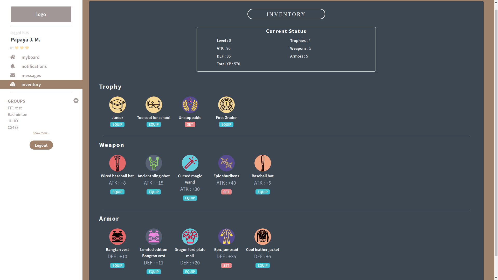
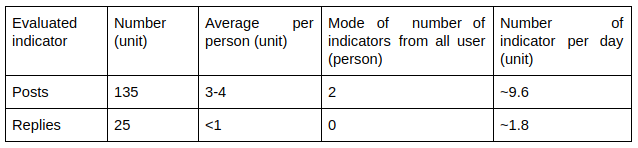

# CS473 Final Report - Anoboard
Authors: Do Duc Huy, Peerapon Akkapusit, Peter Mushick, Wasachon Chaisirirat

### Quality Arguments
The following explains the special features of Anoboard. Implementation was done using the React / Redux frameworks and the Firebase database. It uses current and well-known web application technologies, ensuring that no potential experts are needed for possible further developments. Also the maintainability of this app is ensured by the usage of this these current technologies. Thanks to the database connection, it is possible at a very early stage to give the users a good impression of the eventual experience. In order for the database to be used properly for every user, a functioning user registration and login function was also implemented.

The UI is based on current web applications and offers a clear presentation of the app and according to user survey an intuitive interface that has been praised many times. The UI is not just a mockup implementation, but all the core features discussed can be tried.

Another element of our app is gamification. In order to fight for the anonymity, attack or defense stats are calculated per user, if you want to uncover the anonymity of a user who has lower defense stats than your own attack stats you are successful, if not then the attacked one remains hidden. This system can already be implemented and is ready for testing. The stats are based on items that the user can receive for specific actions, such as posting or replying. After researching, we came to the conclusion that our gamification approach is special and unique. Unlike traditional applications where gamification plays only a minor role, gamification is an important part of our user experience. One of the main pillars of our application, anonymity, is broken up by gamification and made playfully usable. The implemented platform offers an excellent opportunity for further work on this topic. We have received very positive feedback on the Gamification implementation, at least as far as our own user survey is concerned. So it would be very interesting to conduct a bigger survey to learn how users react to the idea in general, how the balance between gamification and the rest of the application has to look like, so that users are motivated but not too distracted. In addition, gamification always raises the question of long-term motivation, which would be another point for research.

By our own test phase and also by user evaluations we have eliminated last Bugs, so that our App runs at the current time without errors. Finally, we did a short test phase in which we tested all functions and the connection to the database without any errors. Thus we are of the opinion that our app is robust with regard to runtime errors.

A big topic, which becomes all the more important in commercial applications, is information security. Since we didn't have the goal to make the app commercially usable in this work, we wanted to concentrate on the important elements of the implementation and the test phase didn't involve any critical data, we accepted some compromises at this point.

### Evaluation
After deploying the application to a server, we started to ask people to use our application, which resulted into having almost 40 users, mostly our friends and acquaintances or other students from CS473 class, who are the most appropriate group for using it. We gave them some basic instructions on how to start using the App, but we did not go into details, because we wanted to know how self-guiding and intuitive our interface is. There was not any testing scenario nor script given to the users and we let them use our application freely. After trying it out, we asked them about their thoughts and experience. We then manually evaluated the feedback as it was only in a text form.

Here are some metrics from our deployment stage:

Period of measurement: 14 days (From 2 December - 16 December) ~ with gamification+
Number of registered users (excluding team members): 39
Average score from all users:
* 7.6 - Functionality
* 9.8 - User interface

Number of user who passed to level 2: 17

We can see that people are most active during the time we instructed them, and most of them just tried to post only without even trying to use the reply. But a lot of users were excited when they got level up and they were introduced more into our RPG system. That includes trying out the equipment and battling other users. Most frequently, people were mentioning how well designed our application is and they really like how it looks like. Important feedback from our users showed us some defects of the application and how to improve them, for example, the loading time takes too long, which is firebase system limitation. Some also pointed out that the purpose of the application is not clear, which may have been caused by lack of real life connection among the users. Yet, having some kind of tutorial would be useful. Also trolling by posting rumors, writing untrue posts or even hateful commentary should be prevented as there were some cases of using swear words without any particular reason. 

Thanks to this testing part, we were also able to fix many bugs and ensure that everything works as it was designed. In a future, using a target user base instead of random crowd, such as a school class or any type of some large social group that shares some activities together and spend time together, can deliver more accurate and helpful results as we were not met with the social interactions we proposed initially. At least, we are to provide really nice user experience from what we have learned. 

## Discussion
There are many implications from this Anoboard project. Our first challenge was thinking of a reasonable social interactions and the urge to communicate within our application. Here, we are relying on anonymity to be a basis of interactions on the platform, but we cannot simply assume that anonymity itself can make people interact with each other. It is then crucial to mitigate every possible downsides of being able to interact anonymously and emphasize the benefits in our experiment with anonymity. We would not be able to provide any better nor more beneficial service otherwise. Unfortunately, because of the time limitations and our inexperience with the technologies, the social part of Anoboard was not sufficiently addressed, and also not fully supported. Some important features, such as notification system, were not implemented, and that itself has affected the flow of interaction as a whole (say, users would not respond to others’ posts on their boards, because they did not realize that the messages were there in the first place).

On the other hand, we were shown that gamification can be an amazingly powerful tool in social computing. In our case it not only made the interactions more frequent and fun (you need to post and reply to others to make a progress in the “game”) but also changed the way people interacted with each other. With anonymity especially, it gave us a natural way how to deal with people exploiting it. This, however, could also bring us away from our primary goal of supporting stronger ties between classmates and acquaintances. The interactions initiated in the effort to dominate in the battle system could be just a random message or could encourage spamming, which would be meaningless considering our purpose. Hence, it is important that the gamification is included properly, not too much and not too less, in our platform, and for that further researches would be required.

In conclusion, by allowing user to talk anonymously to anyone, people tend to talk & troll more, since they might not know each other and can speak more freely. But the main concept should not be based on anonymity itself, which additionally must be handled very carefully. That opens up another question related to ethics in social computing, to which extent should we control or even censor the users content. Other than that, there are still many ways how to improve our application interface and especially gamification part, which we did not have initially in our project proposal. Moreover, making the game mechanics balanced is one the biggest tasks we have faced and have not solved yet. 

### Individual Reflections

* **Do Duc Huy**

Even though it was difficult to setup a meeting together due to very different schedules, we usually discussed everything after our CS473 class and it was enough to finish our project. We also communicated a lot in our group chat so we managed to collaborate remotely very efficiently. Everyone took their role responsibly and we never had a problem to finish our tasks. However, due to my own lack of experience with web development, most of the programming was depending on the rest of the team, which was sometimes annoying because I did not know clearly how our application works internally and I had to ask others even about small things. 

Looking back, I should have put more effort into understanding our codebase and web development frameworks as well. What is more, I realized meeting others in person is not always necessary and resolving issues and discussing thing can be done online which is more flexible and less time demanding. I can appreciate more the importance of having a diverse team consisting different people (which we had), although it can lead to some disagreements and misunderstanding. Working on this project proved me it is better than having bunch of people having the same opinion and not questioning anything. 

Most importantly, I learned how difficult it actually is to utilize social computing and design it correctly to reflect your ideas and work how you imagined it. And in many cases, you would imagine somehow but the reality will be different. It requires a lot of your own social skills too, because you cannot make a good social computing system without knowing how to be social in the first place. But that is a crucial part of the learning process. I was quite surprised how important is to have not only usable and working solution, but the design and the overall graphical appeal matters as much as the usability and performance. Next time, I will emphasize on the look of our application definitely more. Overall I enjoyed this project a lot and learned many new things and technologies related to Web Development, which is not my specialization.

* **Peerapon Akkapusit**

In my point of view, this project has given a lot of experiences in both technical and teamwork aspects. We have split our works into 4 tasks for each team member, and assigned each work using trello in the beginning and github afterwards, since we noticed that it was not that effective for trello, and it is hard to catch up because someone is not familiar with trello. Furthermore, the tasks were not assigned very equally, someone had to work very hard and someone did not have to work that much.

Apart from that, deadline for each tasks should be more precise for each work in order to finish and wrap up all works faster to have more complete works. It would be best if we could have weekly meeting and update each team member’s progress. Since this will force them to work harder in order to prepare for the project meeting.

There were also some misunderstanding among teammates when we described the details of instruction such as type variables, criteria or output the other member wants, and we needed to fix it afterwards. This might happen due to the fact that team members did not carefully read the other team member’s instruction and details. And the reason might be because the instruction was too long, and most people tend to ignore it at the first glance. So my second lesson is how to find a better way to give more precise instruction to your teammates in future projects.

Apart from that, overall, all the implementations and deployment were working fine. Although a lot of bugs occurred during the implementation, and we took some times to fix it, we have discovered a lot of ways and knowledge about React.js, important functions such as componentDidMount, redux, asynchronous task between React’s rendering and firebase data fetching to resolve those bugs. Furthermore, when we further proceeded on the implementation, a lot of new ideas such as gamification occurred. Aside from that, evaluating the application through real users was a good experience to hear from real users directly and understand many different aspects from users. Something also did not go well as we expected, for instance, some of users we made an appointment forgot the appointment, took longer time than it should be, or troll around posting what it was not supposed to be there (bad words). And we argued about should it be shown in the final presentation or not. This is the first time, I had to reconsider my understanding about ethical issues, since each team member have different cultures and ethical aspects. But we finally decided to vote for censoring it in the final presentation and rarely mention it. But in a nutshell, this project will be one of the best project I will never forget. :)

* **Peter Muschick**

I would like to start with the overall assessment and then set out a few points in the following: The project has taught me some very interesting experiences. I would like to further explain the three points of cultural exchange, project planning and implementation and the technical aspects of implementation. The first thing I noticed about the group discussions was that the meeting of people from different cultures was accompanied by a somewhat different style of discussion than I knew it from home. I have the feeling that I was used to communicating more openly and directly than in the conversations in this team.

Of course, there were misunderstandings and inconsistencies between individual group members from time to time, and I once again noticed that honest and open communication is the key to successful and above all stress-free group work.

I found the discussions mostly very positive, with each member, some more and some less, contributing to all the discussions. It was characteristic for the many discussions that none of the team members had any prior knowledge of the technologies used. Especially at the beginning, this might have been helpful so that we could better assess the amount of work involved. At this point, the discussion with the professor was very helpful, as it made us more focused on the actually important tasks of our project. This took a lot of unnecessary work off our hands later on. The participation in the discussions was very satisfying, all members contributed to the discussions at any time and I always had the feeling that nobody was particularly disadvantaged.

I found the implementation with current technologies such as React and Firebase an exciting thing, although in retrospect I have to say that the associated implementation effort was too high at times. Of course, this is not due to the technologies, but to the tasks that we ultimately choose for ourselves. I would also like to say that we mainly used Google services to collaborate on teamwork, which I found very positive. I've been working a lot with LaTeX lately (version control via either Overleaf or Git) and felt that Google is more intuitive and pleasant to use overall.

I worked on all parts of the project, and I enjoyed working on the presentations. We agreed on the individual responsibilities in advance and were thus able to work on the topics individually. Before the presentation we checked the compatibility and made constant adjustments.

The project was characterized by the professor's meaningful specifications, which certainly contributed a large part to the success of the project. The deadlines and tasks gave us a framework in which we could organize our work well. I can well imagine that without the milestones, contributions and inputs, the cooperation would not have been so well regulated.

* **Wasachon Chaisirirat** 

The project cost a lot of time and effort, but I would say all has been a very meaningful experience. Despite being inexperienced with the technologies, we have managed to practice and implement them successfully. Moreover, although a handful of issues and features are yet to be addressed, those that we have already brought up were structured very carefully--even more than I expected. This might be because members in our team are largely diverged in backgrounds and point of view, which make our discussions highly constructive. Apart from that, I also think we did a great job in bringing up the battle system. Most of the users has mentioned it with excitement, and it was the main incentive for them to use our platform.

In spite of us having similar view on the main concept, we faced with some inconsistencies when it comes to the details. There were a few times when the implementation came out differently from the preceding design or the plan at that moment, and we spent much time trying to fix such inconsistency and bring everyone to the same page. The potential cause might be from how we usually discuss things on Facebook, which make it harder for members to not miss any message and fully understand one another. It could have been better if we had moved the chatroom into work-specific environment such as slack, or alternatively do the face-to-face meeting. We have also tried to use tools like trello or git project board to keep track of working progress, but often it would be forgotten. We still have to ask around for current work status personally, and that could also be a possible reason for our inconsistency. I then learned the importance of having a project leader/manager together with a well-constructed set of rules or regulation. It could save as plenty of time.

My responsibility laid mainly on the frontend, and I have got the chance to work with React/Redux. I am not very familiar with Javascript before, so this is a really great opportunity to start learning the language and its framework. I also got to know firebase as well.

Our final prototype depends largely on the gamification process, and from that is how I got to see its power. I did believe in the influence of gamification when reading class materials, but seeing users getting hyped because of the game confirmed that very strongly, and it was just amazing. I also have gone through a lot of discussion on quality controls, as in how to prevent users abusing the battle system, or taking control of unhealthy comments with the anonymity exploitation.

Overall, this Anoboard project has been a very challenging task. I have to learn new technologies in quite a short time, and also had a few hurdles communicating with teammates and finishing all the work in time. But all the efforts spent there gave me a priceless experience, and I take this project as something I sincerely enjoyed.

### Video
[YouTube link](https://youtu.be/b0mw3knbdUo)
