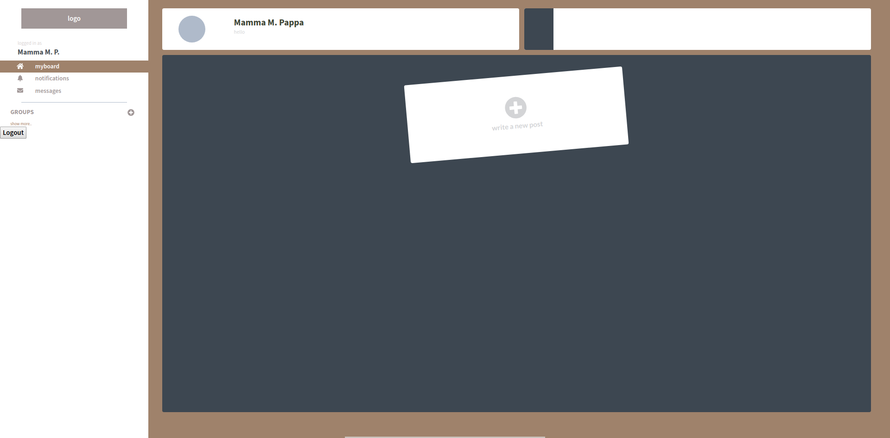
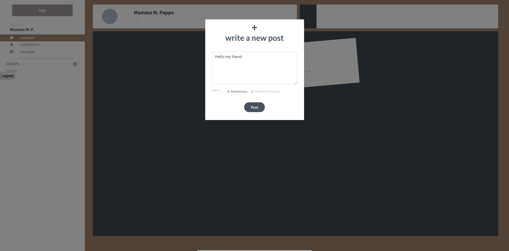
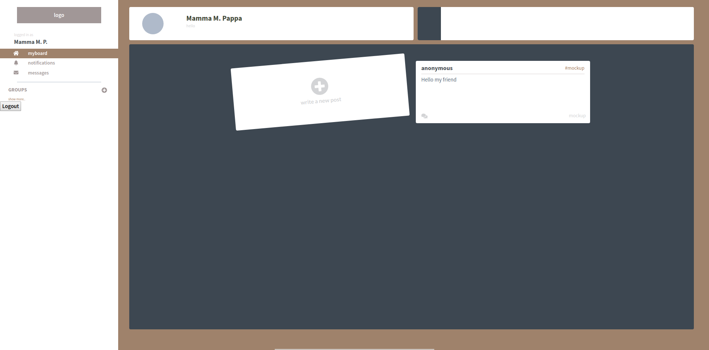
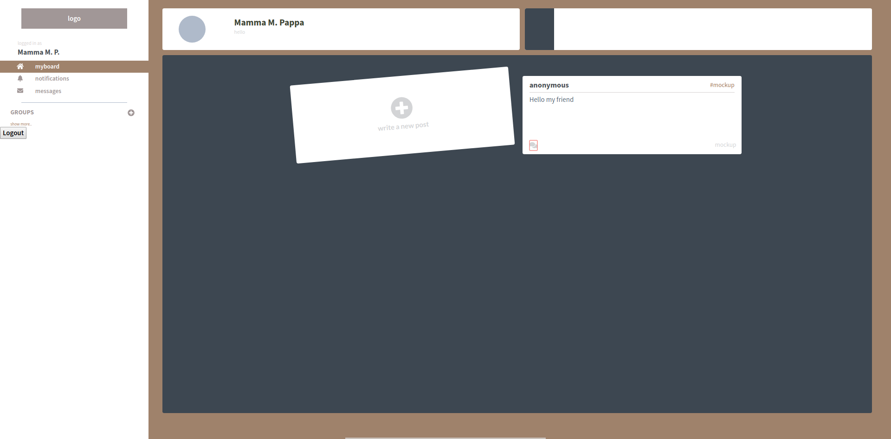
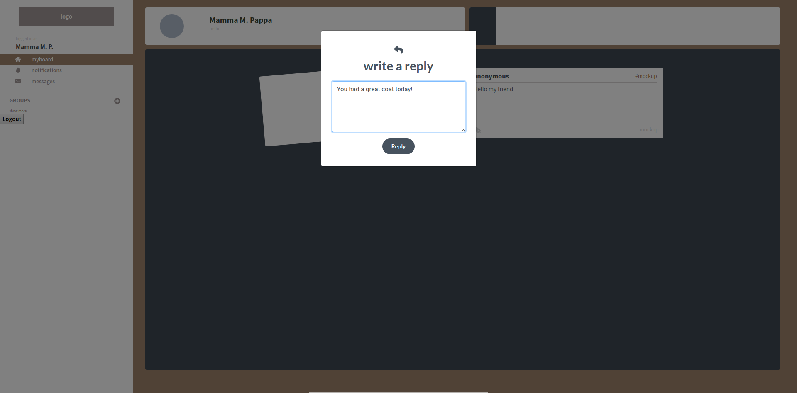
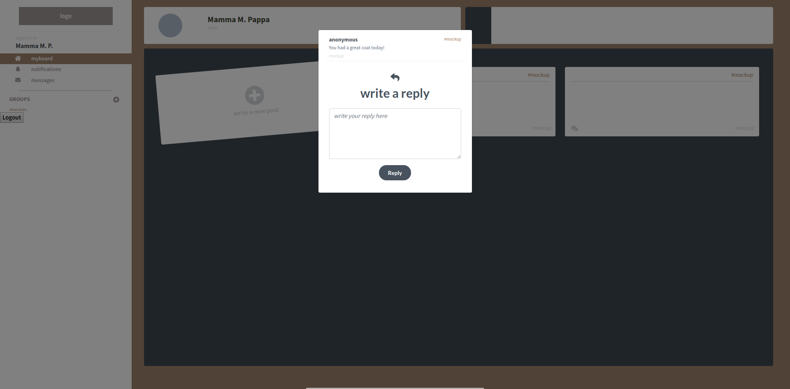
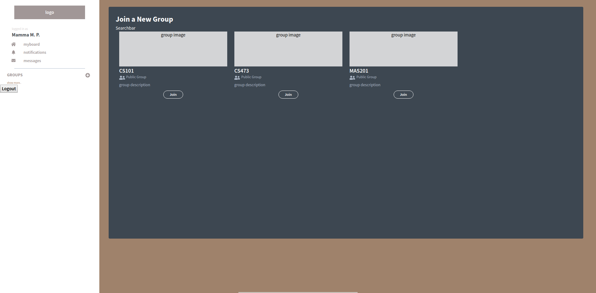
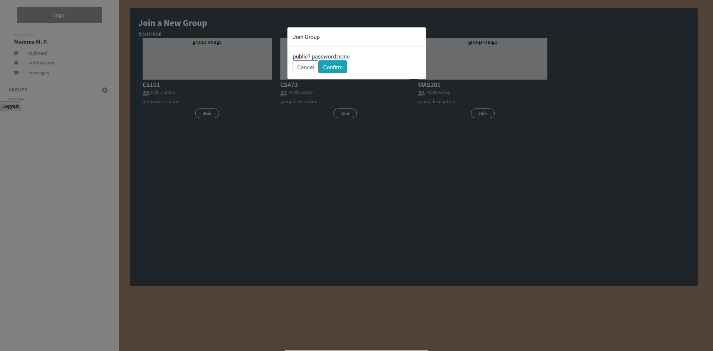

# High-Fi Prototype - AnoBoard
### Project summary
Due to shyness, uncomfort, and inconvenience, classmates that have never known each other outside the classroom before are not likely to initiate or join in a conversation even though they participate in class sessions together for a considerably long time. These issues are addressed with Anoboard: an application, which gives strangers the possibility to contact each other anonymously by posting their messages on each others personal boards without their identity. Secret ingredient of our application is anonymity, which can allow us not only to discover and encourage new and extraordinary interactions, but also help users to overcome their social barriers.

### Instructions
Before using the system, you will need to sign in to the application. Please use these login credentials:

* email address: `cs473@anoboard.com`
* password: `anoboard` 
	
Our application currently support creating a post on your own board and replying to the message. Also you can join a social group to find some new anoboard users. Instructions with additional screenshots below will help you try out these tasks. 

* **Create a post**
    1. Board - click on the plus button in the post placeholder

    2. Prompt - write message into input field.

    3. Prompt - Options: choose if you want to post anonymously or not

    4. Prompt - submit your post

* **Reply to a post**
    1. Board - click on the speech bubble icon in the left down corner of chosen post

    2. Prompt - write a reply and submit

    3. Prompt - look at the post to see the reply

* **Join a group**
    1. Sidebar - click on the plus icon next to the Group title
    2. Groups - click on the join button for the group you want to join

	2. Prompt - confirm, that you want to join the group

### Prototype URL
> http://143.248.140.158:7180/signin

### Github repository URL
> https://github.com/prethrolic/anoboard-app

### Dependencies
* fontawesome-svg-core: ^1.2.8
* free-solid-svg-icons: ^5.5.0
* react-fontawesome: ^0.1.3
* bootstrap: ^4.1.3
* firebase: ^5.5.8
* node-sass: ^4.10.0
* react: ^16.6.0
* react-bootstrap: ^1.0.0-beta.1
* react-dom: ^16.6.0
* react-router-dom: ^4.3.1
* react-scripts: 2.1.1

### Individual reflections
* **Peerapon Akkapusit**
    1. Which part of the system did you directly contribute to?
        * I have contributed to the backend part for the whole system which includes 
        * Sign in and Sign up system - I need to pass the create simple frontend which will retrieve data such as username and password from 
        * Authentication for users
        * Data Structure for database using Firebase 
        * Passing data from backend through frontend considering asynchronous tasks from fetching data and rendering the page (using componentDidMount, componenDidUpdate)
    2. What were some of the difficulties you faced?
        * Miscommunication within the teammates, even though we have a clear instruction provided at the beginning in Github, when we actually work on it, most of us did not follow the whole instruction which make some bug to occur (mismatch types of variable, data stored in firebase). And it takes much more time to solve and discuss it
        * Understanding the idea of React,js is another hard task, I took some time to understand and try to solve some bugs occurred by integrating it to database due to its asynchronous process. 
        * It is hard to solve bugs, since I can not do free-style coding like I usually do when I worked alone, but I have to follow some instructions and pattern of the code to satisfy my code with others. This is another part that I spent a lot of time for it.
    3. List one useful skill you learned while working on the high-fi prototype.
        * It would obviously be React.js programming skills and concepts. Now I am totally clear on on basic concepts of React.js and know how to integrate it with Firebase. Apart from that, our team has used Trello, Github Project which prioritize time and schedule, and I learned a lot more about git issues too.

* **Wasachon Chaisirirat**
    1. Which part of the system did you directly contribute to?
        * My contribution in this project is devoted mostly in the front-end development. I am responsible for designing and implementing UI system, using mainly ReactJS framework together with sass/scss stylesheet. To be more specific, my code would be the render() function in all the components and scss files.I also implement a few sections in API between front-end and back-end structure, such as parsing the data sent from the database and structure the data accordingly to how it is to be used in the front-end components.
    2. What were some of the difficulties you faced?
        * I would say that the most difficult and problematic process of the project was the communication between front-end and back-end, not only as an application, but including also the communication between group members as well. We were utilizing project boards on GitHub to put on the model of the data structure, but the details we have previously discussed were so few that it could be interpreted in various ways, and we did not realize that until the conflicts appeared during API implementation. I even felt like solving these conflicts took us more time than the actual system coding. It could have been better if we had discussed more about how data will be used and store, report it in details and make sure that everyone is on the same page before beginning the implementation.
    3. List one useful skill you learned while working on the high-fi prototype.
        * Building a website using ReactJS Framework and React libraries.

* **Duc Huy Do**
    1. Which part of the system did you directly contribute to?
        * My main task was to deploy our project on the remote server, which required a lot of configuration and solving problems with npm modules, which did not work a lot of times.
        * I helped with Git repository configuration.
        * I was appointed to write the report about our High-fi prototype as well as writing down necessary information into repository README.md file. 
    2. What were some of the difficulties you faced?
        * Deploy the application with all the dependencies and configuration from our developers was slightly complicated because of the support of NodeJS environment can be different on different machines, especially on Linux. I encountered a problem with installing node-gyp module many times, which made me unable to participate on the work more. 
    3. List one useful skill you learned while working on the high-fi prototype.
        * I learned how to use and configure NodeJS npm package manager
        * I also got some hand-on experience with Docker, that I had to use in my local environment to run the application.

* **Peter Mushick**
    1. Which part of the system did you directly contribute to?
        * First I did contribute in the beginning to the structure of the system technically and by organization
        * In general I worked on the connection between the database and our application like fetching or updating data from database
        * Also especially worked on “group” functionality in the application 
        * Also documenting the work by doing the github issues or this report
    2. What were some of the difficulties you faced?
        * The main issue was that we were using react and firebase both frameworks which we had little or no experience before. So I felt that I needed more time for implementation
        * But I really like the work with firebase and react since I think they are made very convenient.
    3. List one useful skill you learned while working on the high-fi prototype.
        * Apart from learning react, firebase and web development, I learned about focusing on major issues while facing a strict limitation of time. 

