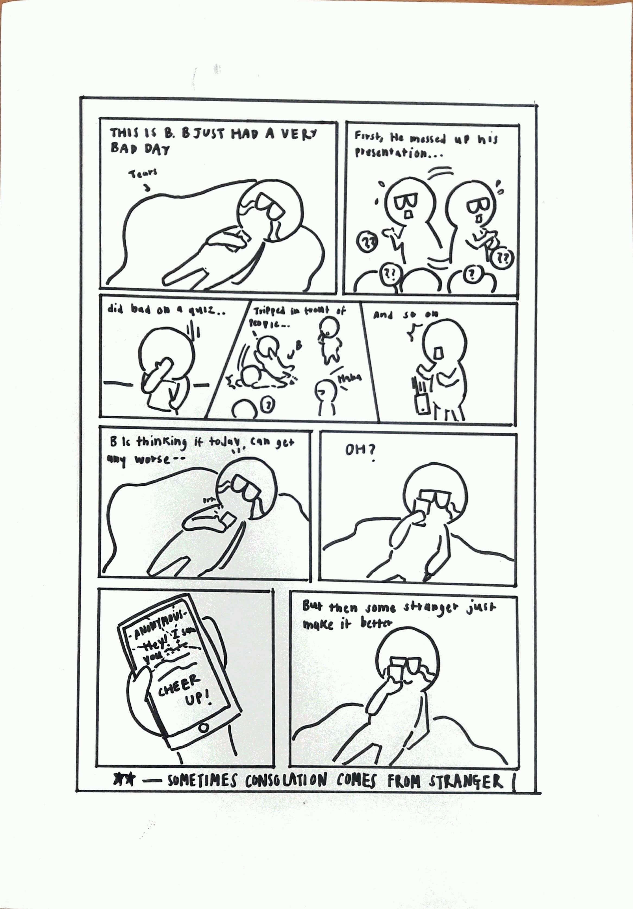
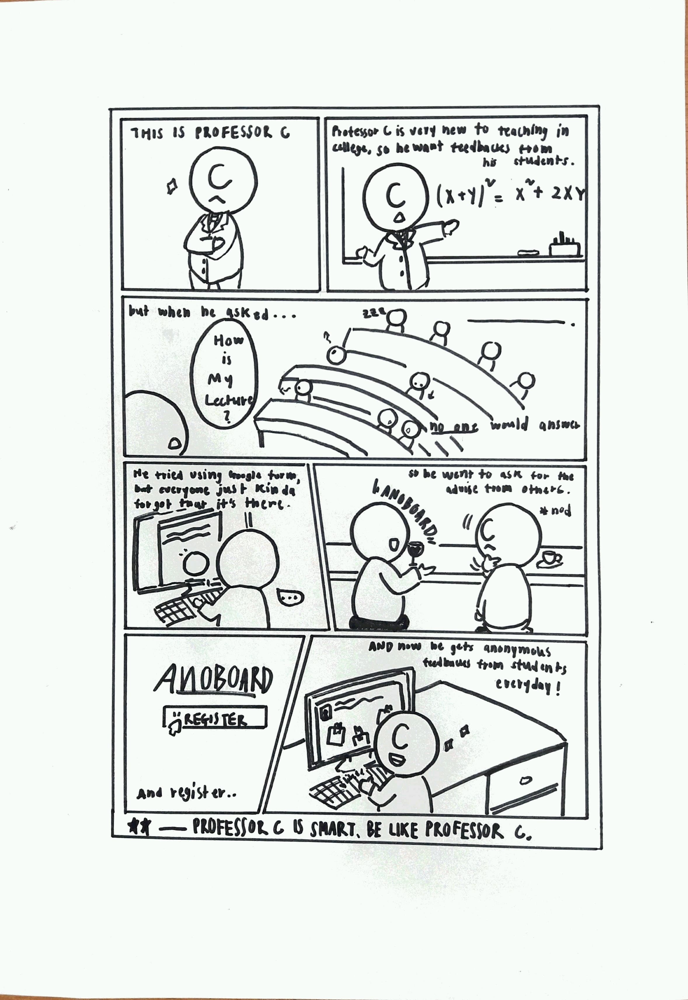

# Ideation - Anonymous Bulletin
This document handles Milestone 1: Ideation of social computing class CS473
https://www.kixlab.org/courses/cs473-fall-2018/design-project.html

### Q0 - Final Team Name 
We are **AИ0BOARD!**

### Q1 - Problem statement
Due to shyness, uncomfort, and inconvenience, strangers are not likely talk to each other even though they are participating in some activities/sessions together or having some connections.

### Q2 - Problem background
The problem of bringing people together who otherwise might never have heard of each other, which we would like to fix with this implementation, is well known to all participants. Be it by the fact that you yourself were affected by shyness or has often observed this in everyday life. Very often one explicitly remembers the situations in which one has overcome the shyness and thereby found a good friend. We would like to pass on this positive experience through the project and support it. According to research paper as the link provided below, they have researched that people have lower social anxiety, social desirability and higher self-esteem when they are anonymous using two forms of questionnaire. This also motivated us to develop this implementation in order to create better behavior for users.
https://link.springer.com/article/10.3758/BF03200723

### Q3 - Motivation (Why social computing?)
Since social computing is, in our opinion, a programming project in which a social aspect is in the foreground, we have decided on an idea that can not be solved with the help of algorithms or predictors. The ability to create an anonymous bulletin board is interesting from a social point of view, as everyone has probably wondered what other people honestly think about themselves. We would like to pursue this question with the future implementation.

### Q4.1 - How Might We questions (at least 10)
1. HMW lower the barrier between strangers?
2. HMW help strangers get closer to each other?
3. HMW encourage strangers to initiate conversation?
4. HMW change mere ‘classmates’ to ‘best friends’?
5. HMW make conversation between strangers more convenient and comfortable?
6. HMW make strangers want to get to know each other?
7. HMW help strangers overcome their shyness?
8. HMW make talking to strangers a common thing?
9. HMW create some situation that brings strangers together?
10. HMW change people’s perception/thought about talking to stranger?

### Q4.2 - Top 3 HMW questions
1. HMW make conversation between strangers more convenient and comfortable?
2. HMW change people’s perception/thought about talking to stranger?
3. HMW create some situation that brings strangers together?

### Q5.1 - Solution ideas for your HMW questions (at least 10 x 3 HMWs)
1. **HMW make conversation between strangers more convenient and comfortable?**
    * Don’t allow direct contact (face-to-face, video chats, calls) to avoid any unnecessary discomfort.
    * Provide a place/platform that users can get contact information of strangers (whom they have connection with in some ways).
    * Create a platform that can be accessed easily (e.g. mobile application, web application.
    * Make the platform for strangers which is easy to use/user-friendly.
    * Make the conversation private and secure.
    * Give hints on how to begin a conversation (such as small short comments in facebook asking how do you feel today? Or it can be any other place).
    * Allow the option of having a conversation only through emoticons, so the users don’t have to think about much about talking.
    * Create chat box that randomly start some conversation between any two strangers in some social application.
    * Ban insulting terms, so users can’t be insulted.
    * Allow a third person to moderate the discussion.

2. **HMW help strangers overcome their shyness**
    * Provide an anonymous environment to encourage them.
    * Create a platform in which they could avoid direct contact to reduce the initial threshold of courage to start a conversation.
    * Make it common to start a conversation with unknown classmates or strangers — change their mindset.
    * Create an environment that welcome conversation.
    * Make it easy to start conversation.
    * Have role models who chat to themselves so people can orientate on conversations.
    * Reward people when they start conversation with strangers.
    * Help people to maintain their new relationships and keep them perpetual.
	* Track their achievements and remind them of their social accomplishments.
    * Make public speaking club (or course) mandatory for students to graduate.

3. **HMW create some situation that brings strangers together?**
    * Open a bar where only solo people have access. 
    * Define random work groups so people have to talk to strangers.
    * Create dormitory rooms where more than one person is sleeping in one room.
    * Cut out menus in restaurants or cafeterias, so people have to ask what’s on the menu.
    * Organize a festival with the topic of connecting people.
    * Organize workgroups where strangers can apply to and solve different tasks.
    * Have a sport team consisting only of strangers.
    * Produce a TV serie where strangers can act together.
    * Reward people for doing collective activities. Strangers can apply for money when starting events including other strangers.
    * Create a state where everyone has to share everything with strangers and its glorious leader.

### Q5.2 - Top 3 solution ideas
1. Provide an anonymous environment.
2. Allow a third person to moderate the conversation.
3. Reward people for collective activities. Strangers can apply for money when starting events including other strangers.

### Q6 - Storyboards (3)

