# Low-fi Prototype - AnoBoard
This document handles Milestone 3: Low-Fi Prototype of social computing class CS473. [Link](https://www.kixlab.org/courses/cs473-fall-2018/design-project.html)
### Problem Statement
Due to shyness, uncomfort, and inconvenience, classmates that have never known each other outside the classroom before are not likely to initiate or join in a conversation even though they participating in class sessions together for a considerably long time.
### Tasks
1. **Register in a group**
Users can register in a group to find the contact information of their classmates. This would be the solution for the scenario where the conversations between classmates are restrained because lack of contact information, and users will be able to get to know each other. Showing member lists with profile pictures, names and biography can also motivate a user to start a conversation with a classmate if his/her profile.
2. **Post on another user’s board**
Here, A user can post on another user’s board to initiate conversation. A note can be posted either anonymously or with the owner of the post shown. Allowing users to post anonymously would help them overcome their shyness and be more comfortable initiating a conversation, giving a feedback, or even asking for help. Implementing this function then would as a result encourage classmates to talk more with one another.
3. **Replying to a post on your own board**
Users can reply to any posts which were posted on their board which make the conversation go on if they want to reply to each other. The owner of the board can see others’ posts which were posted anonymously or public, and the reply can also be selected whether the owner of the board wants the reply to be anonymous or public, in other words, the reply can be selected to show to only the person who posted the particular post or shown to everyone who visit the board. This directly answers the problem of having a hard time talking to strangers, since you can reply to each other conveniently.

### Prototype
>[Link to current prototype](https://marvelapp.com/470ad8g/screen/49312380)
1. **Prototyping Tools**

    * Reasons?
To create a Low-fi prototype, we have chosen Marvel, because of these reasons. It’s a free, multi-user, collaborative online tool, which has an intuitive design and instantly generates design specs. It provides space sheets which refer to each page of the prototype and link them to each other easily by using a capture from the screen. Team designers can comment on specific part in the design easily using annotation for the image which make it easier to collaborate as a team.

    * What worked well?
After choosing the platform it is no problem to start right away. No complicated registration is required because we are using only the free plan, and the unpaid section already has enough for the prototype in this stage. Also Marvel has a intuitive design so there is no manual needed. It also provides collaborator to give their opinions and work together as a team in a convenient way.

    * What did not work well?
Creating a bigger screen with a lot of elements inside seems to get slower quite fast. Primary designs are easy to make, but it is difficult to make them look “professional”, in other words, a high-graded design. It would be nice if Marvel would provide more templates in every aspect (e.g. Forms, Buttons, Web designs). It could also be more convenient if the functions for moving elements immediately between background (farthest backward) and foreground (farthest forward) are provided. Now only a stepwise moving is possible, and it required unnecessarily too much time when the webpage start getting more complicated. This functionality would come handy especially in bigger projects. In the editing screen of a website, the scrollbar is also moving very slow. Users need to scroll very often with the mousewheel to get to the bottom of a menu. So the time-friendly is another issue for users and designers too.
		
2. **Design Choices (What we intentionally NOT implemented)**
    * We did not implement a login screen since the main functionality is not affected by this function, although its an important features, since user should be distinguished by their names.
    * A list of all friends is not implemented yet, since the fundamental use case is posting on other users’ walls and not a direct messaging.
    * User-to-user Messages were not implemented. The fundamental possibility of connection users is realized through posting on each others wall. A user-to-user- messaging system is a part of the communication possibilities, but we don’t plan any new innovation in this part.
    * If a user wants to join a group, a password is needed. The current version works also with an empty password field. For easier use, this functionality was not implemented yet.
    * If a typo occurs in the search field, it is not corrected and similar groups are not shown. This is a comfort-feature and not necessary in the first version of this application.
    * Notifications are designed only for brief understanding of providing some information when other users reply, comment on your board. But we intentionally did not implement what would be inside, since all notifications for that user will obviously be shown, and it is not necessary for our tasks in this case.
    * Fake data such as, contents inside each post, friends’ name, groups’ name are not entirely implemented yet because we need just only particular fake data to represent how the design works, and all of them should work the same way.

## Representative Screenshots

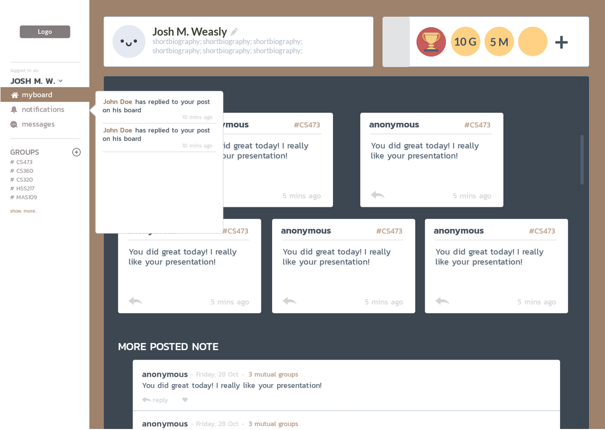
Start screen: View of the own board of the signed up user.
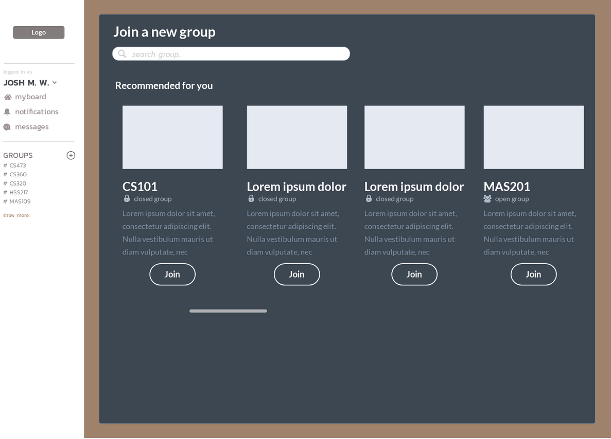
Searching for a group: When the search function is used, groups are shown.
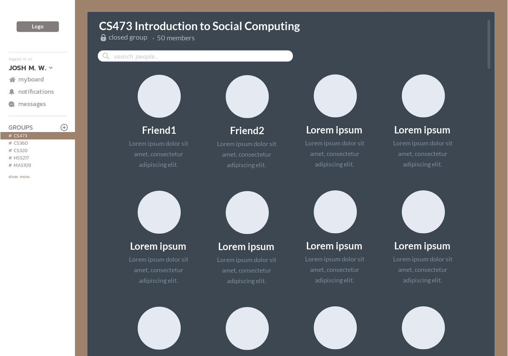
Searching in a group for a specific user.
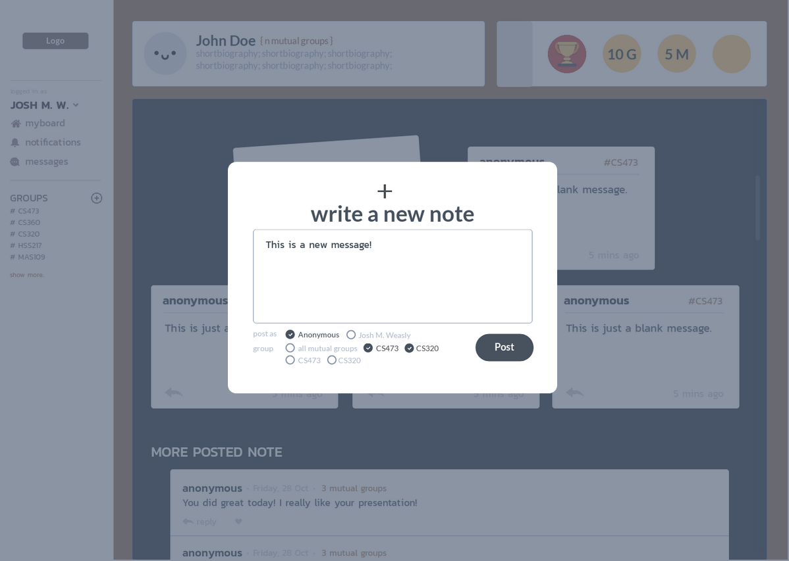
Posting on other user’s wall.

## Instructions for running the prototype
Here is the instruction for testing the prototype for the three tasks presented:
1. **Register in a group**
	a. Users can register to a new group by clicking button "+" beside the Group list on the side menu
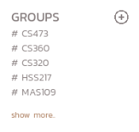
	b. Click on the search bar to search for the name of the group.
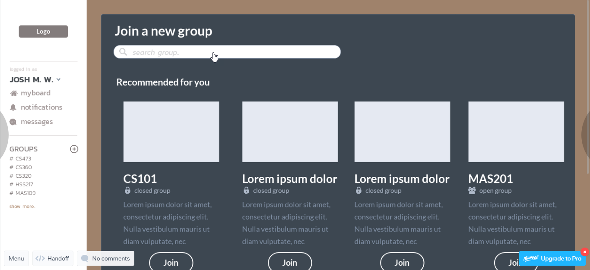
	c. User can register for a group by clicking the button "Join".
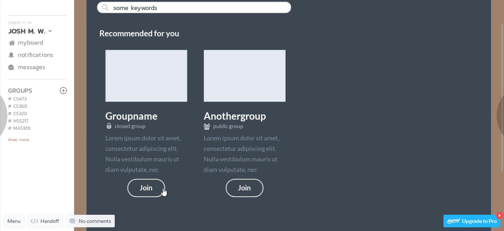
    d. A popup asking for confirmation for joining the group will appear. A password will also be required if the group is set to private (closed group). Click “Confirm” to join the group.
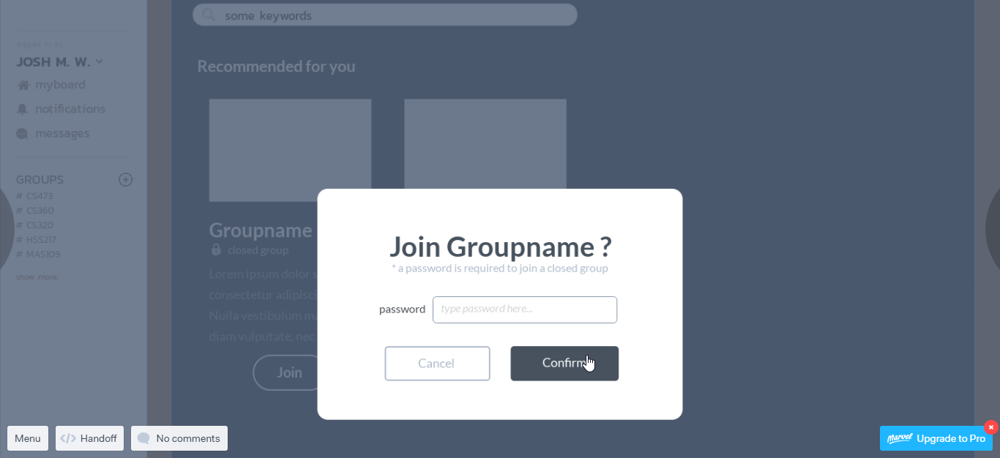
    e. There will be a notification saying that a user has successfully joined on the bottom right of the screen.
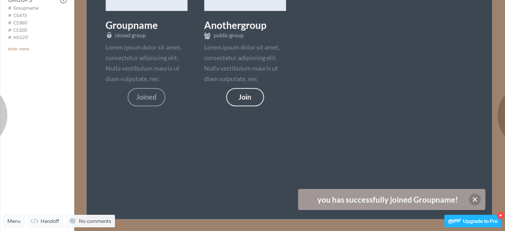

2. **Post on another user’s board**
	a. After registering in a group, information of the group members can be found by clicking on the group’s name. Click on #CS473 to go to the group page.
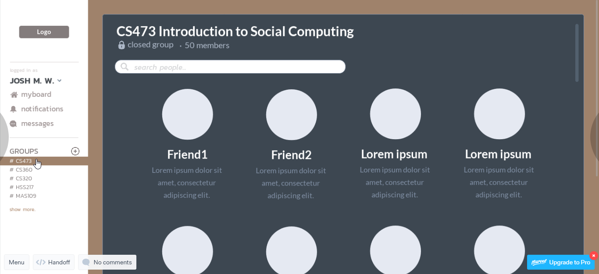
	b. A board of another user can be accessed by clicking on his/her profile. on the group member list. Here, the user can either
    * Choose the profile from the member list (click on a user’s profile as shown above). 
    * Click on the search bar to search for members in the group. In this case, the result of the search will be shown and click on a user’s profile to access his/her board.
    
    c. On the board, click the rectangle frame with the icon "+" to post a new note.
    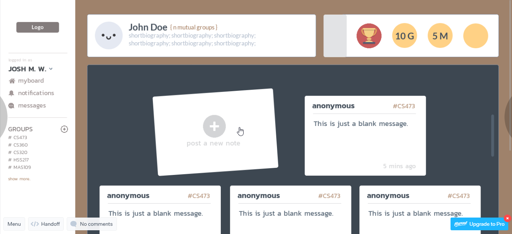
    d. A popup will appear for the user to type the message, choose anonymity, and choose group tags to be displayed. In this prototype, the options has already been set, so just click “Post.”
	e. The pop up will be closed and there will be a bar notifying successful posting at the bottom right of the screen.

3. **Replying to the post on your own board**
	a. A board of a user can be accessed by clicking on "myboard" on the side menu.
	b. On the board, click the arrow icon on the bottom left of each post to reply as shown below where the cursor point to.
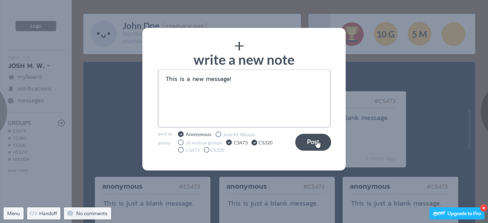
	c. A popup will appear for the user to type the message. The user would be able to choose to open the reply to the public (anyone visiting the board would be able to see the reply), or showing the reply to only him/herself and the owner of the post. In this prototype, the option has already been set, so just click "Reply".
	d. The pop up will be closed and there will be a bar notifying successful replying at the bottom right of the screen.

### Observations
1. **Lacking Rewards menu (P1)**
    * The rewards (gamification element) are shown in the top right corner of the initial screen, but there is no possibility of having a closer look on all trophies obtained.
    * Level of criticality: High
    * Improvement Plan: In the current prototype, there is no interface in the left menu for rewards information that a user could have a closer look on all obtained rewards. We will implement this functionality in the next version. For now it’s sufficient, that users know that rewards are a part of this application by showing them in the initial screen.
2. **Reply icons on the notifications are not noticeable**
    * P3 could not see reply button very clearly at the first glance. On the initial user screen previous posts of other users are shown. On each of  these posts, a small arrow pointing to the left is visible. It is meant to be used as a button for replying, but the functionality of this arrow could be unclear to user.
    * Level of criticality: Medium
    * Improvement Plan: Change the icon for reply to be something more understandable, such as a conversation bubble and make it larger to be seen more easily.
3. **Users cannot see more information in a post inside other’s board**
    * When users (P5) wants to see more content inside each post inside one’s board (P4’s  board), he could not see it, since the feature did not provide the functionality.
    * Level of criticality: Medium
    * Improvement Plan: Each post should be able to be clicked and show more contents inside with respect to the owner of the board settings. If P4 (the owner of the board) decided not to show the content of a particular post to anyone, the contents should be hidden.
4. **Click on menu point “Group” at the left of the prototype doesn’t show anything**
    * If P4 clicked on the menu point on the left, no groups are shown.
    * Level of criticality: Medium
    * Improvement Plan: We will implement in later version the functionality, that a list of groups and groups’ information that user has already joined appear, when a user clicks on the menu point “Groups”.
5. **An ambiguity in edit button (pencil icon) on the profile on top of the board(P5)**
    * Because the edit profile button (pencil icon) was placed next to the name of the user in myboard page, P5 thought that he could use that edit function only to change name, and cannot find the button to edit biography.
    * Level of criticality: Medium
    * Improvement Plan: The edit profile button will be move to somewhere more appropriate, most likely to the bottom right of the profile box, and add a tooltip to indicate that it is meant to be used for editing profile.
6. **Group add icon may be confused with create a new group**
    * When P4 wanted to join a new group, he was not sure about the plus button, because it looks like create another group to him. 
    * Level of criticality: Medium
    * Improvement Plan: We should use more specific icons and labels to make it clear what is the purpose of that button on the page.
7. **The notification when you have finished posting, replying, or some actions is not clear**
    * When P6 have finished posting, he did not see the notice which was shown that you have already posted, he had to scroll down to see the notification and the group is changed from “Join” to “Joined” which is not that obvious for P5.
    * Level of criticality: Medium
    * Improvement Plan: The notice about any action will be moved to the middle of the screen, and after finished some actions such as posting, replying, the posted screen or reply statement that user just wrote will be shown in the board.
8. **Notifications hover effect (P2) + Click on notification opens new empty window (P2)**
    * When P2 hovered over the left menu point “notifications” an info box appears, containing approximately five interactions of the user’s board. This info box hides the content behind it and doesn’t feel well placed. Also a click on the notification opens a new empty window.
    * Level of criticality: Low
    * Improvement Plan: We will think about a different location of this info box and implement a full notification page on the newly open window.
9. **Function of the platform’s logo**
    * P1 tended to click on the logo (mockup) when trying to return to his own board because in almost every online application, a click on the logo brings a user back to the starting/initial screen. But the logo was not linked to anything in this prototype.
    * Level of criticality: Low
    * Improvement Plan: We plan to place a link over the logo of this app, so a user will be able to use the known functionality of getting fast and convenient back to the initial screen.
10. **User misunderstand the gray tab beside the reward icons**
    * P4 tried to tab on the gray tab beside the rewards feature at top right of one’s board, since he thought it would show more details instead of “Plus” icon shown at the most right
    * Level of criticality: Low
    * Improvement Plan: the gray box will be used as a frame for placing the word “Trophy” to make it easier for users to understand that they are able to set up trophies on their board. However, because Marvel does not support rotating text to vertical, weIn late prototypes, 
